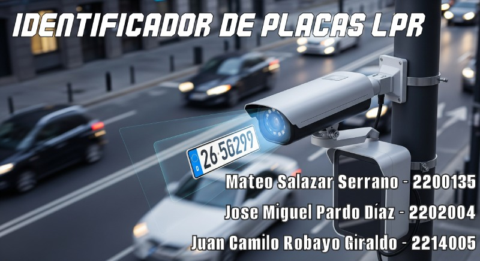

# Detección de Placas de Carros IA2

## Autores
Jose Miguel Pardo, Mateo Salazar Serrano, Juan Camilo Robayo

## Objetivo
Detectar placas vehiculares en imágenes usando un modelo entrenado YOLOv5.

## Dataset
El dataset utilizado fue descargado de Kaggle: [License Plate Dataset – Ronak Gohil](https://www.kaggle.com/datasets/ronakgohil/license-plate-dataset/data)

Contiene 1650 imágenes de vehículos con placas, junto con sus respectivas anotaciones en formato YOLO. Las imágenes varían en condiciones de iluminación, ángulos y distancias, lo que permite entrenar modelos más robustos. Las anotaciones incluyen solo una clase: license_plate.

## Modelos
Ultralytics, Yolov5, Yolov8n, Yolov8s, Tesseract, EeasyOCR.

## Enlaces del proyecto
- [Notebook](https://colab.research.google.com/drive/1IrIGIHIqLSAXmwOEJlMoOrxRrMSEvq0u)
- [Repositorio del código](https://github.com/mxgue13/Detecci-n-de-Placas-de-Carros---IA2)  
- [Video](https://youtu.be/OtbFWuYEcDg)  
- [Diapositivas](https://www.canva.com/design/DAGnhRpO_Hc/bE3dyepf_6nWb9zCPO84eQ/edit?utm_content=DAGnhRpO_Hc&utm_campaign=designshare&utm_medium=link2&utm_source=sharebutton)
  
